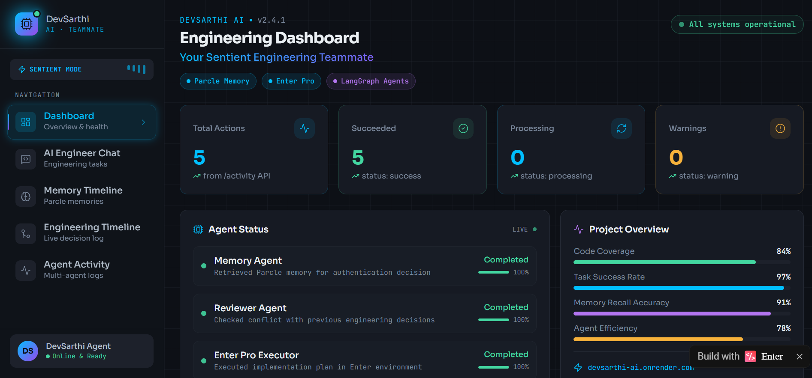
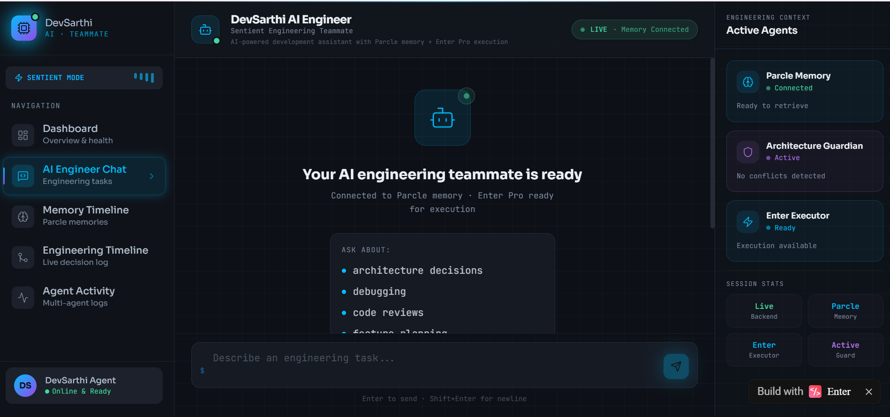
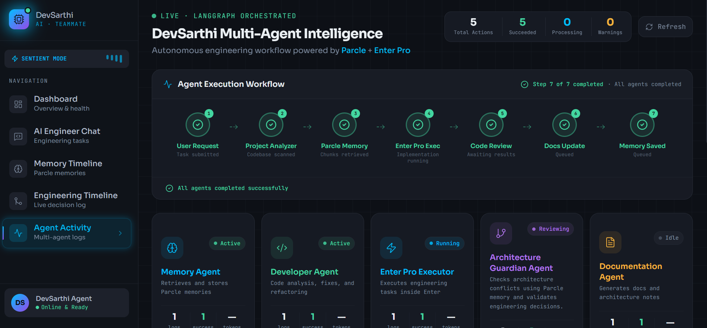

## DevSarthi AI 🤖
## The Sentient Engineering Teammate with Persistent Memory

An autonomous AI software engineer that remembers project decisions,
understands engineering context, and improves development workflows
using Parcle Memory + Enter Pro.

## Overview

DevSarthi AI is an autonomous AI engineering teammate that helps developers build, debug, review, and document software projects.

Unlike traditional coding assistants, DevSarthi AI maintains long-term project memory using **Parcle** and performs engineering workflows through a multi-agent system powered by **LangGraph** and **Enter Pro**.

The system remembers previous architectural decisions, retrieves relevant context before reasoning, executes engineering tasks, reviews changes, and updates documentation.

---

# Problem

Most AI coding assistants are stateless.

They:
- forget previous decisions
- repeat solved mistakes
- lack team context
- cannot maintain project history

DevSarthi AI solves this by creating a persistent engineering memory layer.

---

## Why DevSarthi AI?

Traditional AI coding assistants are stateless:
- They forget previous fixes
- They repeat architectural mistakes
- They lack project-level understanding

DevSarthi introduces persistent engineering memory.

It remembers:
- Architecture decisions
- Bug fixes
- Technology choices
- Development history

Every future task starts with previous knowledge.

---

# Features

## 🧠 Persistent Engineering Memory (Parcle)

- Stores project decisions
- Saves previous fixes
- Remembers architecture choices
- Retrieves relevant context before every task

Example:

User:
Add authentication module

AI remembers:

Use Supabase Auth
Do not use Firebase
Follow existing React + FastAPI architecture

---

## 🤖 Multi-Agent Engineering System

Built with LangGraph.

Workflow:

User Request
  ↓
Project Analyzer Agent
  ↓
Memory Agent
(Parcle Retrieval)
  ↓
Developer Agent
  ↓
Enter Pro Execution Agent
  ↓
Reviewer Agent
  ↓
Documentation Agent
  ↓
Parcle Memory Update

---

# Agents

## Project Analyzer Agent

Analyzes:

- repository structure
- technology stack
- project files

## Memory Agent

Responsible for:

- retrieving previous decisions
- storing new knowledge

## Developer Agent

Acts as senior engineer.

Provides:

- implementation plans
- architecture decisions
- technical solutions

## Enter Pro Execution Agent

Uses Enter Pro workflow.

Responsibilities:

- reads project context
- prepares implementation steps
- executes engineering tasks

## Reviewer Agent

Checks:

- architecture consistency
- possible conflicts
- quality issues

## Documentation Agent

Maintains:

- README updates
- architecture notes
- project history

---

# Tech Stack

## Backend

- Python
- FastAPI
- LangGraph
- Gemini API
- Parcle Memory API

## Frontend

- React
- TypeScript
- Tailwind CSS
- Modern dashboard UI

## AI Infrastructure

- LangGraph Agent Workflow
- Parcle Persistent Memory
- Enter Pro Execution Environment

---

# Architecture

User
|
v
React + TypeScript Dashboard
|
v
FastAPI Backend
|
v
LangGraph Agent Orchestrator
|
+----------------+
| |
v v

Parcle Memory Enter Pro
(Persistent (Execution
Knowledge) Environment)

|
v

Reviewer Agent + Documentation Agent
|
v

Updated Engineering Memory

---

# Setup Instructions

## Clone Repository

```bash
git clone <repository-url>
cd DevSarthi-AI
```

## Backend Setup

Go to backend:
```bash
cd backend
```

Create virtual environment:
```bash
python -m venv venv
```

Activate:
- Windows:
  ```bash
  venv\Scripts\activate
  ```

Install dependencies:
```bash
pip install -r requirements.txt
```

## Environment Variables

Create:
```bash
.env
```

Add:
```env
PARCLE_API_KEY=your_key
GEMINI_API_KEY=your_key
ENTER_PROJECT_URL=your_enter_project_url
```

## Run Backend

```bash
uvicorn main:app --reload
```

Server:
http://localhost:8000


---

# API

## Chat Endpoint

POST:
/chat


Example:
```json
{
  "message": "Add authentication module"
}
```

Response:
```json
{
  "answer": "Implementation plan...",
  "analysis": {},
  "memory": []
}
```

---

# Hackathon Track

Track:
Software — The Sentient Workspace


Built using:
- Parcle as persistent memory layer
- Enter Pro as execution environment

---

## Demo

Live Demo:
https://abe0233cd6d843b7a3b6c1d7044cab0c.prod.enterapp.pro

The demo shows:

1. User submits engineering request
2. Memory Agent retrieves previous decisions
3. Developer Agent creates solution
4. Reviewer checks consistency
5. Documentation updates project history
6. Memory is stored for future tasks

---

## Screenshots

### Engineering Dashboard



### AI Engineer Chat



### Agent Workflow



---

# Future Improvements

- Real code patch generation
- GitHub integration
- Automated pull requests
- Team collaboration memory
- CI/CD agent

---

# Team

## Hackathon Submission

Track:
Software — The Sentient Workspace

Built with:

- Parcle → Persistent AI Memory
- Enter Pro → AI-native execution environment
- LangGraph → Multi-agent orchestration
- FastAPI + React → Full-stack platform

DevSarthi AI demonstrates how AI agents can evolve from
simple assistants into long-term engineering teammates.

---

